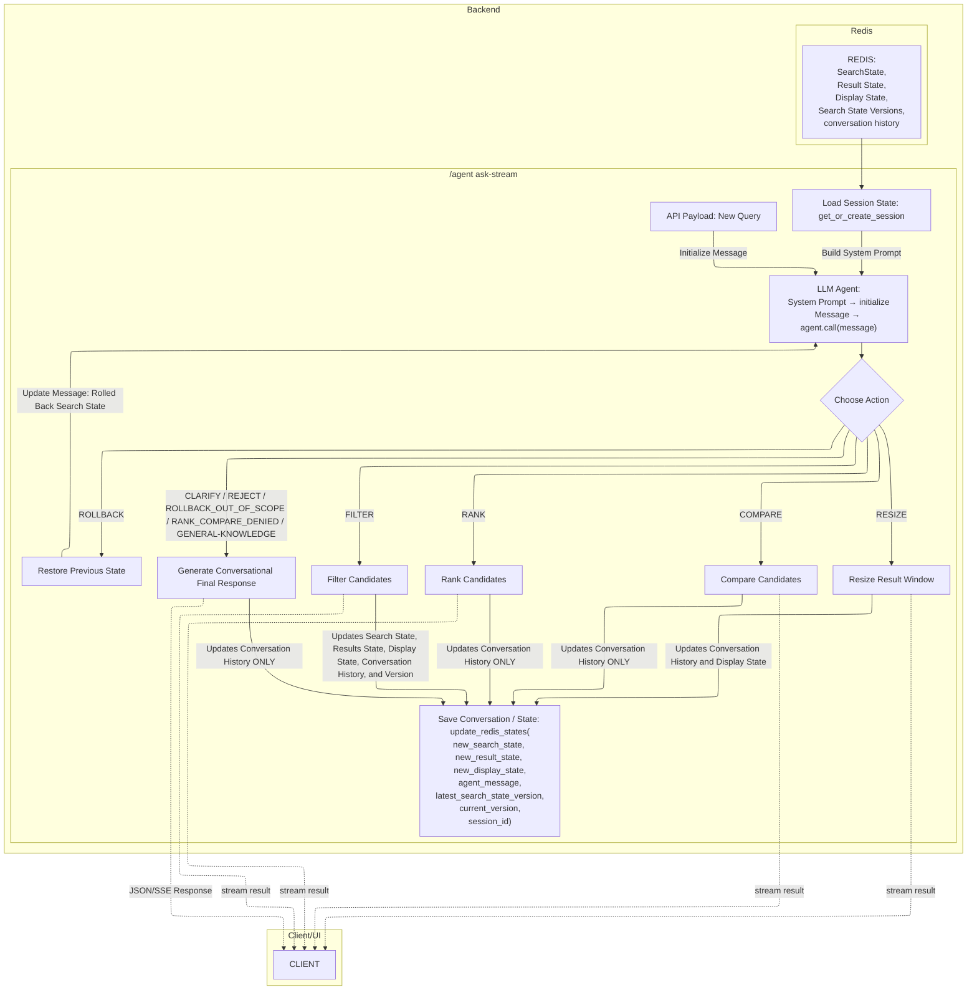

```mermaid
---
config:
  layout: elk
---
flowchart TD


    %% =========================
    %% FASTAPI AGENT SERVICE
    %% =========================

    subgraph TOP["Backend"]
        direction LR
    
        subgraph AgentService["/agent ask-stream"]
            direction TB

            API[API Payload: New Query]
            SESSION[Load Session State: get_or_create_session]
            LLM["LLM Agent:<br/>System Prompt → initialize<br/>Message → agent.call(message)"]

            ACTION{Choose Action}

            FILTER[Filter Candidates]
            RANK[Rank Candidates]
            COMPARE[Compare Candidates]
            RESIZE[Resize Result Window]
            ROLLBACK[Restore Previous State]
            FINAL[Generate Conversational Final Response]

            SAVE["Save Conversation / State: <br/>update_redis_states(<br/>new_search_state, <br/>new_result_state, <br/>new_display_state,<br/>agent_message,<br/>latest_search_state_version,<br/>current_version,<br/>session_id)"]

            SESSION -->|Build System Prompt| LLM
            LLM --> ACTION
            API --> |Initialize Message|LLM

            ACTION -->|FILTER| FILTER
            ACTION -->|RANK| RANK
            ACTION -->|COMPARE| COMPARE
            ACTION -->|RESIZE| RESIZE
            ACTION -->|ROLLBACK| ROLLBACK
            ACTION -->|CLARIFY / REJECT / ROLLBACK_OUT_OF_SCOPE / RANK_COMPARE_DENIED / GENERAL-KNOWLEDGE| FINAL

            ROLLBACK -->|Update Message: Rolled Back Search State| LLM

            FILTER --> |Updates Search State, Results State, Display State, Conversation History, and Version|SAVE
            RANK --> |Updates Conversation History ONLY|SAVE
            COMPARE --> |Updates Conversation History ONLY|SAVE
            RESIZE --> |Updates Conversation History and Display State|SAVE
            FINAL --> |Updates Conversation History ONLY|SAVE
        end

        subgraph Redis["Redis"]
            REDIS[REDIS: \n SearchState, \n Result State, \n Display State, \n Search State Versions, \n conversation history]
            REDIS --> SESSION
        end

    end

    subgraph Client["Client/UI"]
        CLIENT
    end

    FILTER -.->|stream result| CLIENT
    RANK -.->|stream result| CLIENT
    COMPARE -.->|stream result| CLIENT
    RESIZE -.->|stream result| CLIENT
    FINAL -.->|JSON/SSE Response| CLIENT
```